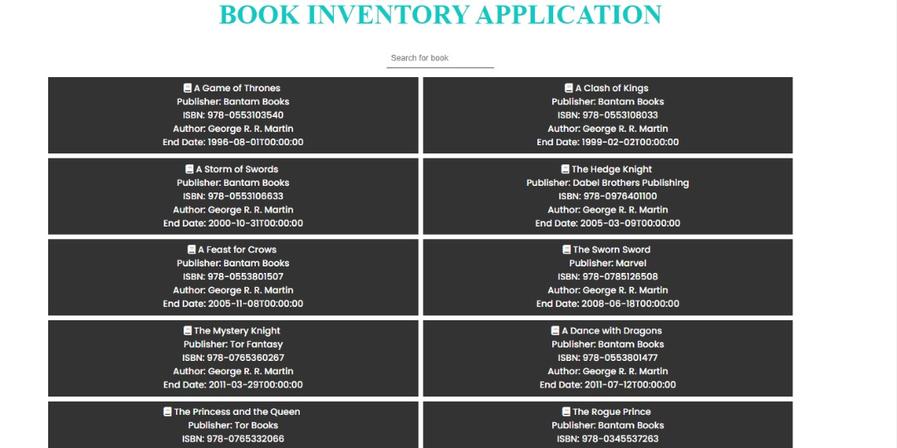

#Book Inventory App

This repository is a book inventory Application which fetches a dommie data from ANAPIOFICEANDFIRE API with ReactJS (Typescript). 

## Built With
JavaScript
Reat.js
Typescript
ANAPIOFICEANDFIRE API

### Setup
create a directory on a your local machin.
clone to you local machine
open your terminal and type: git clone https://github.com/chidiebereojingwa/book_inventory_app.git
### Usage
Clone project to your local machine 
Intall packages with "npm install"
run application with "npm start"
## Authors

👤 **Author1**

- GitHub: [@githubhandle](https://github.com/chidiebereojingwa)
- Twitter: [@twitterhandle](https://twitter.com/ojingwa)
- LinkedIn: [LinkedIn](https://linkedin.com/in/chidiebereojingwa)
## 📝 License

This project is [MIT](./MIT.md) licensed.

